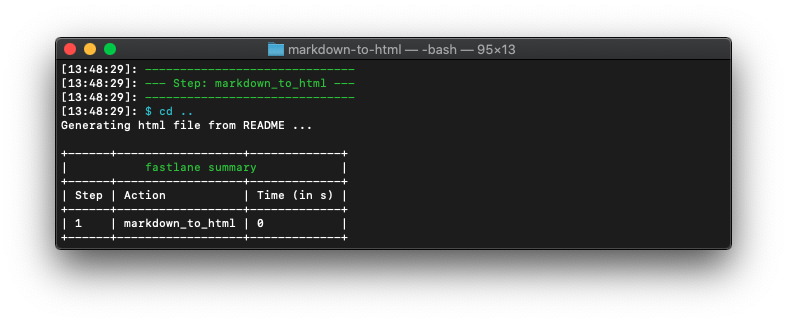

# markdown_to_html plugin

[](https://rubygems.org/gems/fastlane-plugin-markdown_to_html)



## Getting Started

This project is a [_fastlane_](https://github.com/fastlane/fastlane) plugin. To get started with `markdown-to-html`, add it to your ***fastlane/Pluginfile***:

```bash
gem "fastlane-plugin-markdown_to_html", git: "https://github.com/duyquang91/fastlane-plugin-markdown_to_html"
```
Then install the plugin by this command:
```bash
$ bundle exec fastlane update_plugins
```

## About markdown_to_html

Github provides us an API to convert a markdown file format to a html file format. You can check it out here: [https://developer.github.com/v3/markdown/](https://developer.github.com/v3/markdown/)  
This plugin bring this API to `fastlane-plugin` with multiple file processing support.


## Available options

| Parameter | Description | Environment variable | Default value |
|-----------|-------------|----------------------|---------------|
|files | An array of markdown files to convert | | |
|output | The output folder where generated html files would be saved | | "/" |
| github_access_token | Github Access Token to fetch the html from Github API | GITHUB_ACCESS_TOKEN |

To get more available options, please run this command:
```bash
$ bundle exec fastlane action markdown_to_html
```

Example:
```bash
markdown_to_html(files: ["README.md"], output: "htmls")
```
> Please be ensure that your output folder is exist.  
If you don't pass the `output` option then all html files would be saved in the root folder of `files`

## Run tests for this plugin

To run both the tests, and code style validation, run

```
rake
```

To automatically fix many of the styling issues, use
```
rubocop -a
```

## Issues and Feedback

For any other issues and feedback about this plugin, please submit it to this repository.

## Troubleshooting

If you have trouble using plugins, check out the [Plugins Troubleshooting](https://docs.fastlane.tools/plugins/plugins-troubleshooting/) guide.

## Using _fastlane_ Plugins

For more information about how the `fastlane` plugin system works, check out the [Plugins documentation](https://docs.fastlane.tools/plugins/create-plugin/).

## About _fastlane_

_fastlane_ is the easiest way to automate beta deployments and releases for your iOS and Android apps. To learn more, check out [fastlane.tools](https://fastlane.tools).
